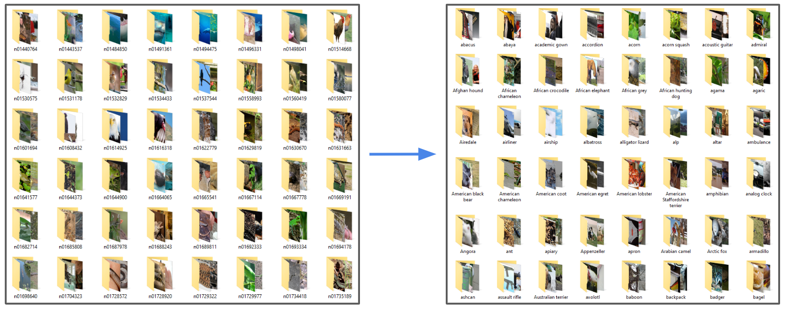

# 🏷️ ImageNet Data TrainingSet Foldername Calibration Using MATLAB

[ImageNet Dataset](https://www.image-net.org/) is universally considered the state-of-the-art dataset within the deep learning domain.  
However, the raw data downloaded from the website uses WordNet synset IDs (e.g., `n01440764`) as folder names, which are not intuitive.  
To address this, we developed a handy MATLAB tool to automatically rename the training folders into human-readable class names.

---

## 📂 Contents

- 📋 Requirements
- 💾 Installation
- ▶️ How To Use
- 🖼️ Example
- 📁 Files Description
- 🤝 Contributing
- 📜 License
- 🙋‍♂️ Author

---

## 📋 Requirements

- MATLAB R2018a or later
- No additional toolboxes required
- ImageNet training data structured as:

/ImageNet
  /train
    /n01440764
    /n01443537
    ...

---

## 💾 Installation

1. Clone or download this repository:
   git clone https://github.com/lestrance/ImageNet_Labels_Sync_MATLAB.git

2. Download the ImageNet Dataset and unzip it into a local folder (e.g., ~/ImageNet/train).

3. Ensure the `.mat` mapping files remain in the same folder as the script (Manual_Labelling.m).

4. Suggested folder structure:

/ImageNet
  /train
    /n01440764
    ...
/ImageNet_Labels_Sync_MATLAB
  Manual_Labelling.m
  ImageNetLabelsMappingInfo.mat
  ImageNet_Classes_LablesAndIndex.mat
  before_vs_after.png

---

## ▶️ How To Use

1. Open MATLAB and navigate to the folder containing `Manual_Labelling.m`.

2. Before executing, update the script to point to the correct local directory paths:

   % Example inside Manual_Labelling.m
   path_to_train = 'C:\Your\Path\To\ImageNet\train';

3. Run the script:

   Manual_Labelling

4. All folders in the training directory will be renamed from WordNet IDs to corresponding class names.

😄 Tip: Always back up your dataset before renaming in case you need to revert.

---

## 🖼️ Example

Folder names before and after running the script:

Before:
  n01440764/
  n01443537/

After:
  tench/
  goldfish/

(See the image: before_vs_after.png)

---

## 📁 Files Description

| File Name                              | Description                                |
|----------------------------------------|--------------------------------------------|
| Manual_Labelling.m                     | Main MATLAB script to rename folders       |
| ImageNetLabelsMappingInfo.mat          | Mapping from synset IDs to class labels    |
| ImageNet_Classes_LablesAndIndex.mat    | Indexed list of class labels               |
| before_vs_after.png                    | Visual demo of folder renaming             |

---

## 🤝 Contributing

Pull requests are welcome!  
If you find bugs or would like to suggest improvements, please open an issue or submit a PR.

---

## 📜 License

This project is licensed under the MIT License – see the LICENSE file for details.

---

## 🙋‍♂️ Author

Created by Shuohan XUE (Roy) (https://github.com/lestrance).  
If you find this project useful, feel free to star the repo or share feedback.

